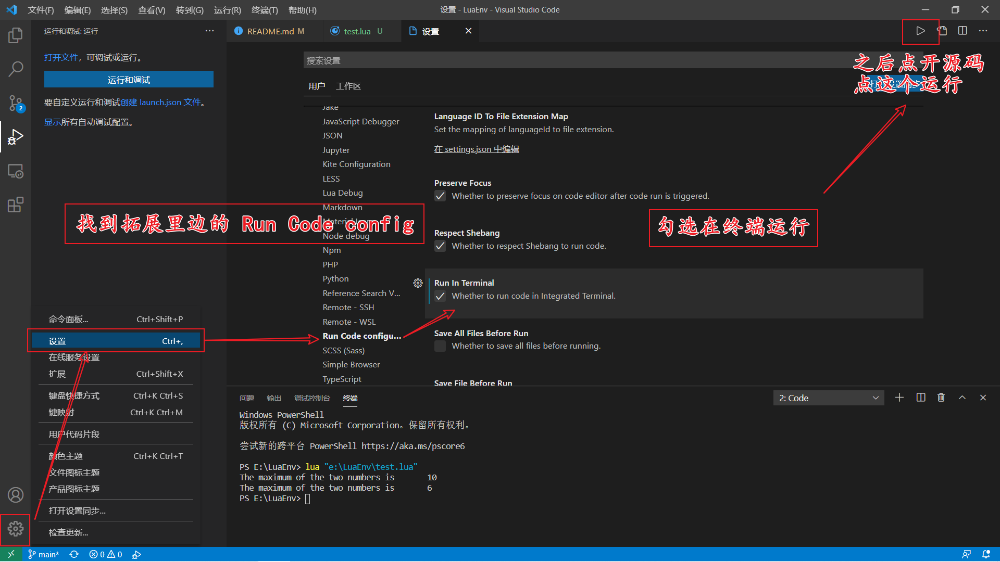

# みなさん、こんにちは！

该环境用于我自己的 Lua 环境搭建，感兴趣的老铁也可以 fork 后 build 一下


Lua 官网：[https://www.lua.org/](https://www.lua.org/)


分为 `windows` 和 `linux`

## Windows

可以从 [http://joedf.ahkscript.org/LuaBuilds/](http://joedf.ahkscript.org/LuaBuilds/) 下载已经编译好的 Lua ，解压后，将解压目录添加到环境变量中去，若只是临时使用，在命令行使用 `set path` 指令 (**只在当前终端有效**)

```shell
set path                           # 查看环境变量
set path =                         # 清空环境变量(用不着)
set path = X:\some_path            # 修改环境变量(用不着)
set path = X:\some_path;%path%     # 添加环境变量(就这个)
```

在本仓库`windows`目录下，提供了 `srlua-5.4.3_Win64_bin.zip` 和 `lua-5.4.3_Win64_bin.zip`，可`git`下来直接用

P.S. `srlua` 用于生成可执行 `lua` 脚本

## Linux

根据官方 [指南](https://www.lua.org/download.html) 先编译，最后一步的安装

```shell
curl -R -O http://www.lua.org/ftp/lua-5.4.3.tar.gz
tar zxf lua-5.4.3.tar.gz
cd lua-5.4.3
make all test
make install # 可能需要 sudo 权限
```

在本仓库`linux`目录下，提供了`lua-5.4.3.tar.gz` 文件，可直接使用


## VScode 插件推荐 

|插件|描述|
| :-: | :-: |
| `Lua Debug` | VScode Lua 开发必备 |
| `Code Runner` | VScode 运行大多数程序都会用到 |
| `Chinese (Simplified) Language Pack for Visual Studio Code` | 一般中文必备 |
| `Material Icon Theme` | 用于图标显示, 只为了好看 |
| `Gitmoji` | git 加个表情, 好用的一批 |


# 附录

### 1.VScode 新手使用指南(插件安装后如何运行)



### 2.测试脚本

```lua
-- 备注：这个玩意是注释
-- `test_examplt.lua` 脚本用于测试是否安装成功
function max(num1, num2)
 
    if (num1 > num2) then
       result = num1;
    else
       result = num2;
    end
  
    return result; 
 end
  
 print("The maximum of the two numbers is ", max(10,4))
 print("The maximum of the two numbers is ", max(5,6))
```